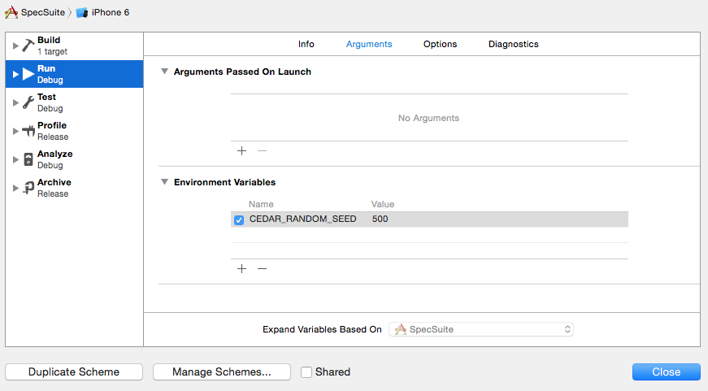

# Thrust Changelog

## Version 0.6

* Drops Android support.  If you want to use **Thrust** to deploy Android apps to TestFlight, use version 0.5.2.

* Drops `ios` prefix from keys in `thrust.yml`:

    * `ios_spec_targets` => `spec_targets`
    * `ios_distribution_certificate` => `distribution_certificate`
    * `deployment_targets` > `ios_target` => `target`
    * `deployment_targets` > `ios_provisioning_search_query` => `provisioning_search_query`
    * `deployment_targets` > `ios_build_configuration` => `build_configuration`

* Adds `spec_directories` configuration key to `thrust.yml`.  This allows you to specify from where `rake nof` removes focused specs.

* Updates `spec_targets` to require the `scheme` name instead of the `target` name.  The `target` key is no longer used.

* Adds support for specifying the MacOSX sdk version in a spec target configuration.  E.g. `build_sdk` can now be set to `macosx10.9` or `macosx10.10`.  Run `xcodebuild -showsdks` to see the full list of available sdks.

* Adds support for specifying the Cedar random seed for spec targets (note that this is not currently supported for spec bundles):

```
CEDAR_RANDOM_SEED=5 bundle exec rake spec_suite
```

* Adds support for reading environment variables set in the scheme.

e.g. If you set a `CEDAR_RANDOM_SEED` in the spec target's scheme in Xcode, the spec task will run with that random seed:



See the [Cedar wiki](https://github.com/pivotal/cedar/wiki/Configuration) for a list of all available Cedar environment variables.

If you are using a spec bundle, you will need to set the environment variable in the scheme for the main app target.


## Version 0.5

##### Version 0.5 introduced a lot of changes.  Please see the *Upgrading* section below after installing the update.

* Removes support for waxsim. Specify `ios_sim_path` to use a non-system installed version of ios-sim.

* Unifies configuration of Cedar Spec Suites and Cedar/iOS/OSX test bundles in `thrust.yml` (breaking configuration changes)

* Fixes hardcoded bundle test destination which was broken in Xcode 6+

* Allows bundles to be built for architectures specified in Xcode project (removes hardcoded ARCHS flag)

* Adds support for specifying an alternate path to ios-sim

* Adds additional options for setting build numbers when deploying to TestFlight by setting the `versioning_method` key in the `thrust.yml`.  The options are:
    * 'timestamp-sha': Sets the build number to a combo of the current date and the SHA of the current commit.  e.g. '1402021234-f57bea'
    * 'commits': Sets the build number to the number of commits in the commit history
    * 'none': Does not update the build number during deploy
    * Default: When you leave the key blank, it defaults to setting the build number to the SHA of the current commit.

* Adds support for setting the TestFlight api token from the command line: `TESTFLIGHT_API_TOKEN='your-api-token' rake testflight:deploy`

* Adds support for deploying from a specific tag.  E.g. if your CI machine tags every successful build with a 'ci' tag, then specify the `tag` key in your deployment configuration to deploy the last successful build.  The feature assumes that the tags conform to the style generated by the [auto_tagger](https://github.com/zilkey/auto_tagger) gem.

* Adds support for specifying `device_name` and `os_version` as arguments to the rake task for each spec target.  Defaults for these should be set in the `thrust.yml`.

## Version 0.4

* Added support for Xcode 6 and ios-sim 3.x.  You should now specify `device_type_id` in your `thrust.yml` instead of `device`.

## Version 0.3

* **Thrust** can now build against Xcode workspaces. In your `thrust.yml` file:

  * Replace the `project_name` with a `workspace_name`.

  * For each build in your `ios_spec_targets`, include `scheme` to specify the scheme to use along with the target.

* If you are upgrading from Version 0.2 or for an example, run `thrust install` and look at the generated `thrust.example.yml`.

## Version 0.2

* **Thrust** should now be installed as a gem, not a submodule.  Running `thrust install` after installation sets up the `Rakefile` and creates an example `thrust.yml`.

* The code has been cleaned up and modularized, making it easier to add new features in the future.

* **Thrust** now supports deploying Android apps to TestFlight.  **Thrust** auto-detects whether your project is Android or iOS and will generate the appropriate rake tasks.

* The structure of `thrust.yml` has been updated, and the names of certain keys have changed to make their meaning clearer.

* All deployments are tagged using [auto_tagger](https://github.com/zilkey/auto_tagger). Run `rake autotag:list` to see which commits are deployed to each environment.

* Deploy notes can be auto-generated from commit messages. Set `note_generation_method` to `autotag` in `thrust.yml` to use this feature.

* Build numbers are no longer auto-incremented during deployment.  Instead, the build number is set to the short SHA of the commit that is being deployed.  Deployment history is managed by auto_tagger.

* You no longer have to be in sync with _origin_ to deploy to TestFlight.

## Version 0.1

* The 'specs' configuration has been replaced by an array of specs configurations, called 'spec_targets'. This is to allow you to specify multiple targets to be run as specs - for instance, you may wish to run a set of integration tests separately from your unit tests. Running one of these commands will clean the default build configuration list (AdHoc, Debug, Release).

* Adds 'focused_specs' and 'nof' tasks to show files with focused specs and to remove them, respectively.

* Adds 'current_version' task to show the current build version of the app.

* TestFlight deploys now prompt the user for a deployment message

* Removes adding to default tasks. This is now your responsibility - please define in your own Rakefile if you need to add to the default task. e.g. `task :default => [:specs :something_random]`

* Adds support for non-standard app names defined in your XCode project. These are determined by looking for the first ".app" file it can find in the build folder and basing the name off that file.

* Adds support for disabling incrementing the build number during a TestFlight deploy. This is via the 'increments_build_number' configuration setting under a distribution in your thrust.yml.
